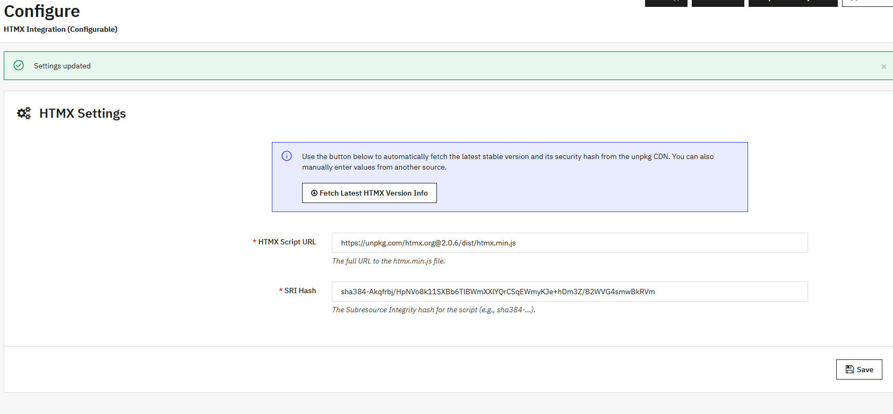

# HTMX Integration Module for PrestaShop 9.0.
might work in older versions with minor changes

[](https://opensource.org/licenses/MIT)


A secure, configurable, and easy-to-use PrestaShop module to add the latest version of [htmx.js](https://htmx.org/) to your shop's front office and back office.

This module is designed with security and stability in mind. It does nothing by default and requires explicit configuration, allowing store owners to lock into a specific version of HTMX with a Subresource Integrity (SRI) hash, preventing unexpected updates and securing against CDN compromises.



---

### Table of Contents

*   [Features](#features)
*   [Compatibility](#compatibility)
*   [Installation](#installation)
*   [Configuration](#configuration)
*   [How It Works (Technical Details)](#how-it-works-technical-details)
*   [Usage Example](#usage-example)
*   [Contributing](#contributing)
*   [License](#license)
*   [Author](#author)

---

### Features

*   ✅ **Secure by Default**: The module is inactive until you configure the script URL and its security hash.
*   🔒 **Subresource Integrity (SRI)**: Enforces browser-level security for front-office scripts, ensuring the file from the CDN hasn't been tampered with.
*   🚀 **"Fetch Latest" Helper**: A smart button on the configuration page that automatically and safely fetches the latest version-locked URL and SRI hash for HTMX from the CDN.
*   🛡️ **CORS Safe**: The "Fetch Latest" helper uses a server-side proxy, so it works perfectly even on servers with strict Cross-Origin Resource Sharing policies.
*   ⚙️ **Flexible**: Allows you to use any CDN or a self-hosted version of HTMX by manually entering the URL and hash.
*   🌐 **Universal**: Injects the HTMX script into both the shop's Front Office and the admin Back Office.
*   🧹 **Clean & Lightweight**: Follows PrestaShop best practices, uses the correct hooks, and cleans up its database entries on uninstall.

### Compatibility

*   PrestaShop `8.0` to `9.x`

### Installation

1.  Go to the [Releases page](https://github.com/[Your GitHub Username]/pshtmx/releases) of this repository.
2.  Download the latest `pshtmx.zip` file.
3.  In your PrestaShop Back Office, navigate to **Modules > Module Manager**.
4.  Click the **"Upload a module"** button and select the `pshtmx.zip` file you downloaded.
5.  The module will be installed automatically. If not, find "HTMX Integration" in the module list and click **Install**.

### Configuration

The module will not load any scripts until it is configured.

1.  After installation, click the **"Configure"** button for the "HTMX Integration" module.
2.  On the configuration page, click the **"Fetch Latest HTMX Version Info"** button. This will contact the `unpkg.com` CDN via a secure server-side proxy to get the latest version-locked URL and its SRI hash.
3.  Verify that the "HTMX Script URL" and "SRI Hash" fields have been automatically populated.
4.  Click **"Save"**.

That's it! HTMX is now active on your front office and back office.

### How It Works (Technical Details)

To provide the "Fetch Latest" functionality without running into browser CORS security restrictions, this module implements a server-side proxy. When you click the button:
1.  A JavaScript request is sent to a custom, non-public Admin Controller within the module.
2.  This PHP controller uses `cURL` to make a request to `https://unpkg.com/htmx.org@latest/dist/htmx.min.js`.
3.  It follows the redirect to get the final, version-locked URL (e.g., `.../htmx.org@1.9.12/...`).
4.  It calculates the `sha384` SRI hash of the downloaded file content.
5.  It returns the final URL and the calculated hash to the browser in a JSON response.
6.  The JavaScript then populates the form fields with this information.

This approach is robust, secure, and independent of any CDN metadata APIs.

### Usage Example

Once configured, you can start using HTMX attributes directly in your theme's `.tpl` files. For example, to add a "Load More" button to a product list:

```smarty
{* In your product-list.tpl or similar *}

<div id="product-list-container">
  {include file='catalog/_partials/products.tpl' products=$listing.products}
</div>

{* Add the button at the end of the list *}
{if $listing.pagination.pages_count > $listing.pagination.current_page}
  <div class="text-center">
    <button class="btn btn-primary"
            hx-get="{$listing.pagination.next.url}"
            hx-select="#product-list-container"
            hx-target="#product-list-container"
            hx-swap="beforeend">
      Load More Products
    </button>
  </div>
{/if}
